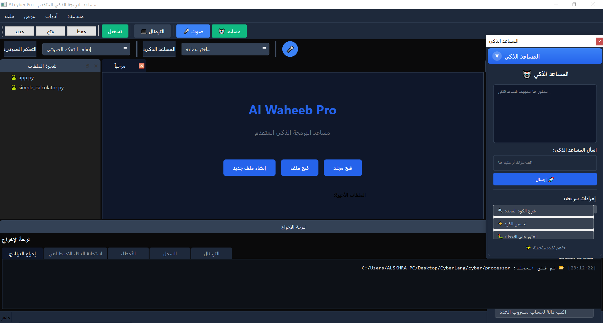
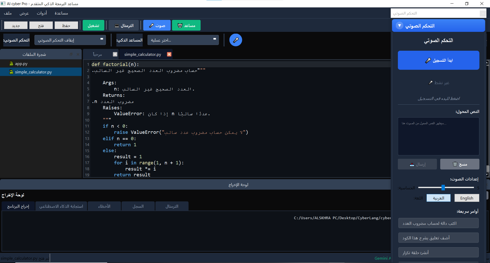
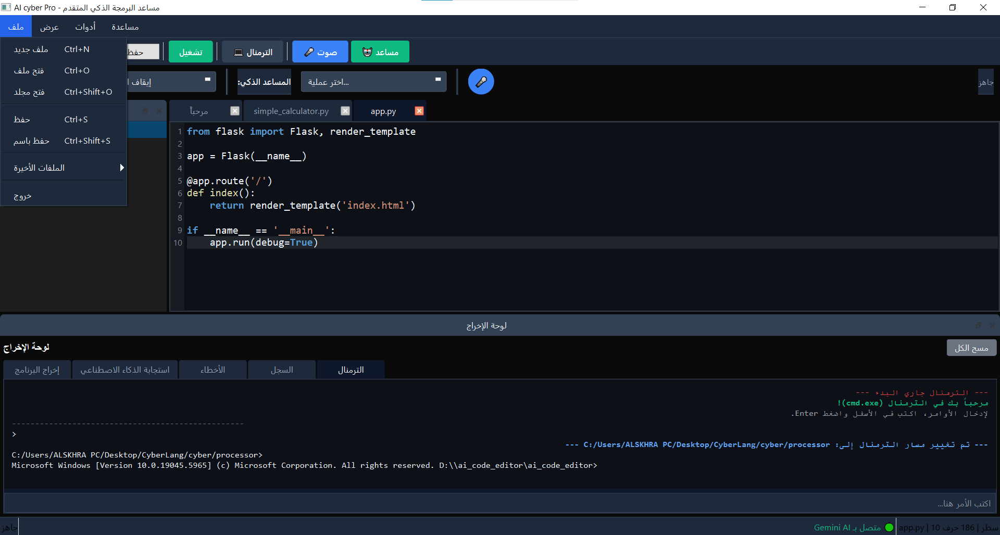
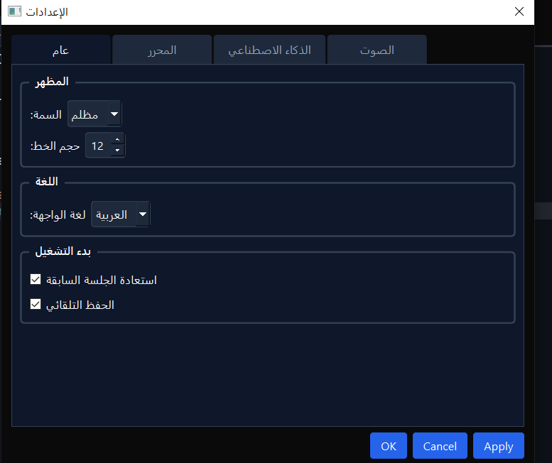

# 🤖 AI Code Editor Pro


Welcome to **AI Waheeb Pro**, an advanced Integrated Development Environment (IDE) that combines a powerful file manager, a smart code editor, and an AI assistant powered by Google Gemini to boost your programming productivity. This application aims to streamline your daily coding tasks, from file management to getting instant AI assistance.

---

## 🌟 Key Features

* **Integrated File Manager:** Easily browse, create, delete, rename, copy, and move files and folders. Supports favorite folders and recent files/folders history.
* **Smart Code Editor:** An advanced text editor with syntax highlighting for various programming languages.
* **Waheeb AI Assistant (Powered by Gemini):**
    * **Code Explanation:** Get detailed explanations for any part of your code.
    * **Code Optimization:** Suggestions to improve code performance and quality.
    * **Error Fixing:** Identify and fix programming errors.
    * **New Code Generation:** Ask the AI to generate complete code based on your description.
    * **Add Comments:** Add descriptive comments to your code with a click.
* **File Execution:** Run Python files directly from the editor and view outputs in a dedicated panel.
* **Integrated System Terminal:** Launch your operating system's default terminal directly from the application in the current project's path, giving you full command-line access.
* **Real-time File Monitoring:** Automatically detects external changes to files and folders and updates the file tree.
* **Auto-Save & Backup:** Never worry about losing your work, thanks to the auto-save feature and smart backup system.
* **Attractive UI:** A sleek and user-friendly design inspired by VS Code.

---

## 🖥️ Screenshots

<div align="center">
    </div>

<div align="center">
    </div>
---

## ⚙️ Requirements

* **Python 3.8+**
* **PyQt6**
* **`google-generativeai`** (for Gemini AI service)
* **`chardet`** (for file encoding detection)
* **`difflib`** (for file comparison)
* Operating System (Windows, macOS, Linux)

---

## 🚀 Setup and Installation

1.  **Clone the Repository:**

```bash
git clone https://github.com/waheeb71/AI-Waheeb-Pro.git
cd AI-Waheeb-Pro

2.  **Create a Virtual Environment:**

    ```bash
    python -m venv venv
    ```

3.  **Activate the Virtual Environment:**

    * **Windows:**
        ```bash
        .\venv\Scripts\activate
        ```
    * **macOS / Linux:**
        ```bash
        source venv/bin/activate
        ```

4.  **Install Dependencies:**

    ```bash
    pip install -r requirements.txt
    ```
    *(Ensure `requirements.txt` in your project root contains `PyQt6`, `google-generativeai`, `chardet`, `difflib`, and any other libraries you use.)*

5.  **Set up Gemini API Key:**
    * Go to [Google AI Studio](https://aistudio.google.com/app/apikey) and create a new API key.
    * Create a **`.env`** file in your project root (`AI-Waheeb-Pro`) and add your API key:
        ```
        GEMINI_API_KEY=YOUR_GEMINI_API_KEY_HERE
        ```

6.  **Run the Application:**

    ```bash
    python main.py
    ```
    *(Or `main.py` or your main entry file's name.)*

---
## 📞 Contact

For questions or support, please reach out to me via:

-   **Telegram:** [@SyberSc71](https://t.me/SyberSc71)
-   **Telegram:** [@WAT4F](https://t.me/WAT4F)
-   **GitHub:** [waheeb71](https://github.com/waheeb71)
-   **YouTube Channel:** [Cyber Code](https://www.youtube.com/@cyber_code1) -   **X (formerly Twitter) Account:** [@SyberSc](https://x.com/SyberSc)

---

**Location:** Taiz, Yemen.

---
